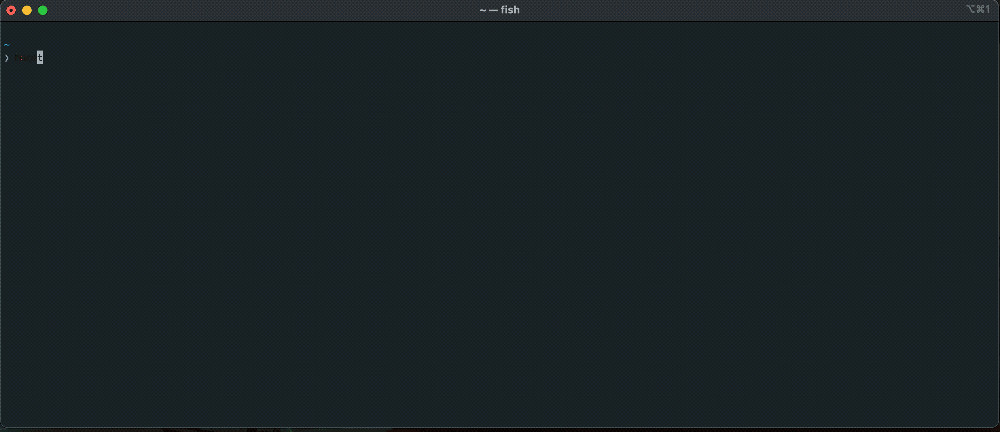

# hncat 🐈

[](https://crates.io/crates/hncat)
[](https://github.com/orf/hncat/actions)

Dump all comments, stories and polls from Hacker News fast.



Table of Contents
=================

* [Install :cd:](#install-cd)
* [Usage :saxophone:](#usage-saxophone)

# Install :cd:

* Homebrew: `brew install orf/brew/hncat`
* Cargo: `cargo install hncat`

# Usage :saxophone:

Running `hncat` will begin to stream all items from the API to stdout in JSON.

```bash
$ hncat --help
hncat 0.1.0
Grab Hacker News items from the API in parallel.

USAGE:
    hncat [OPTIONS]

FLAGS:
    -h, --help       Prints help information
    -V, --version    Prints version information

OPTIONS:
        --concurrency <concurrency>    Make this many concurrent requests [default: 200]
        --end-date <end-date>          Ignore all items created after this date. Supports relative durations like "1
                                       hour" as well as absolute rfc3339 dates
        --last <last>                  Fetch the last X items
        --limit <limit>                Limit the number of outputted rows to this
        --since <since>                Fetch all records since this time. Supports relative durations like "1 hour"
        --start-date <start-date>      Ignore all items created before this date. Supports relative durations like "1
                                       hour" as well as absolute rfc3339 dates
        --start-id <start-id>          Fetch records with IDs higher than this
        --stop-id <stop-id>            Fetch records with IDs lower than this
```
